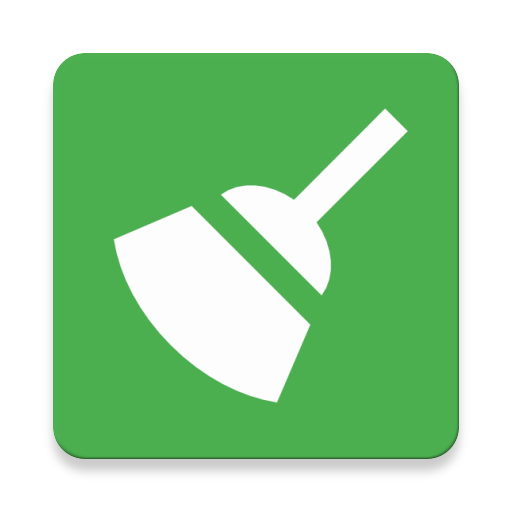
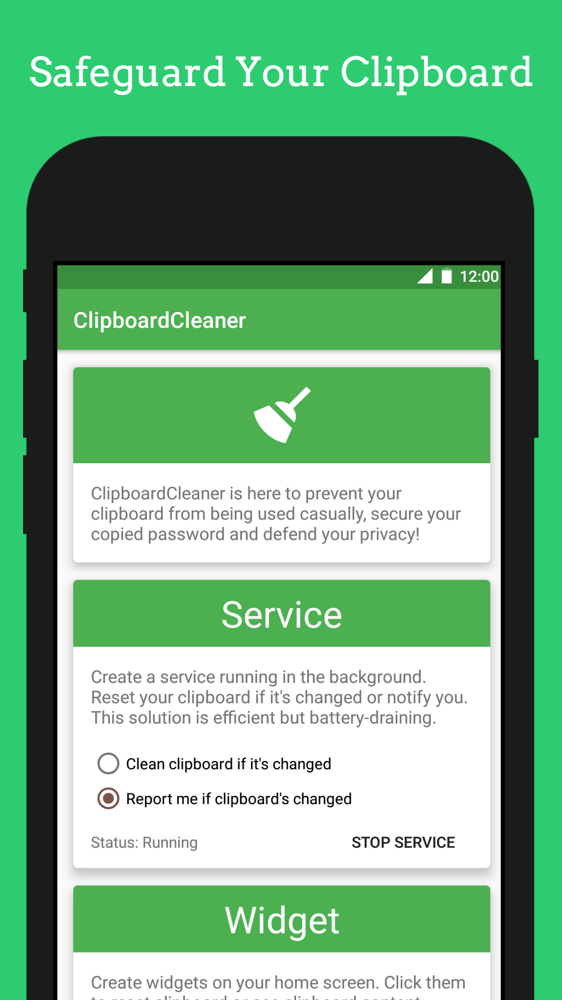
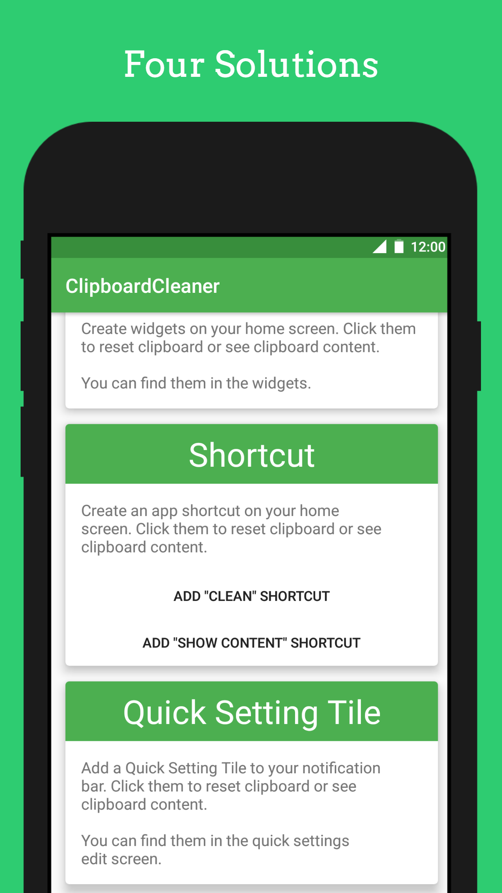
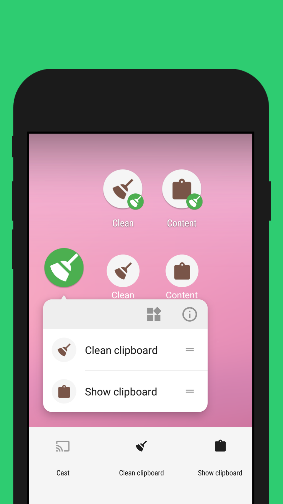

  

<h1 align="center">Clipboard Cleaner</h1>

  <strong>Check and clean your clipboard using service, widget, shortcut, and quick setting tile.</strong>

 

    
    
    
    

 

## Screenshot

||||
|:-:|:-:|:-:|
||||

## Why

As you may know, Android clipboard content and its changes can be got by any app, which is a security hole if you care about it(more info is mentioned [here](https://github.com/grepx/android-clipboard-security)).
Any app can get your copied password, credit card numbers and more.

However, ClipboardCleaner can't protect your passwords from being got by any app(after all it's a security hole). But it gives you ways to check and clean your clipboard.

Fortunately, Android has AutoFill or other mechanisms to handle sensitive info. [Android Q also fixes this problem once and for all](https://developer.android.com/about/versions/10/privacy/changes#clipboard-data).

## Update

- 1.4.1

  - Target Android Q
  - Show reasons for the app failure when the app is installed for the first time.
  - Fix Android 4.X crashes

- 1.3.0

  - Added a timeout option for the service- Added a help icon which explains why this app may not work.
  - Upgraded the target sdk to Android Pie

- 1.2.1

  - Fix app crash after system restarting on Android O or later

- 1.2

  - Use foreground service to monitor clipboard changes

- 1.1

  - Use keyword/regex to determine if clipboard should be cleaned.

## License

[MIT License](./LICENSE)
